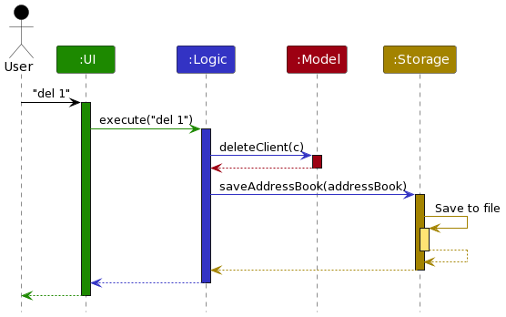
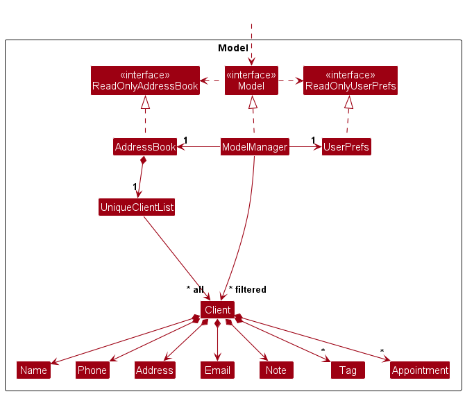
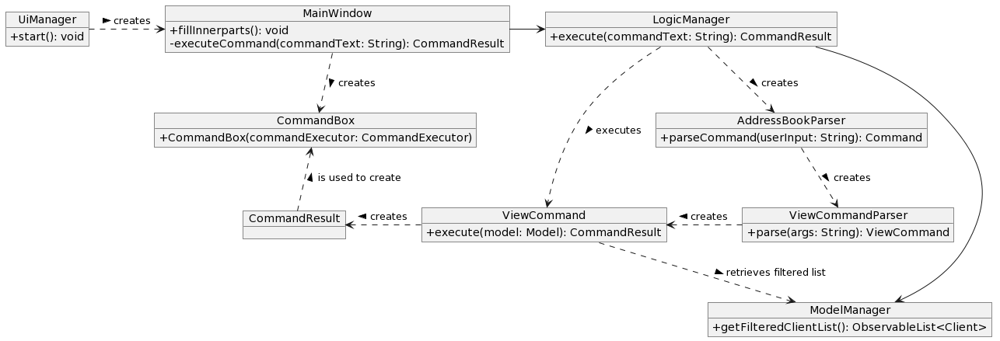
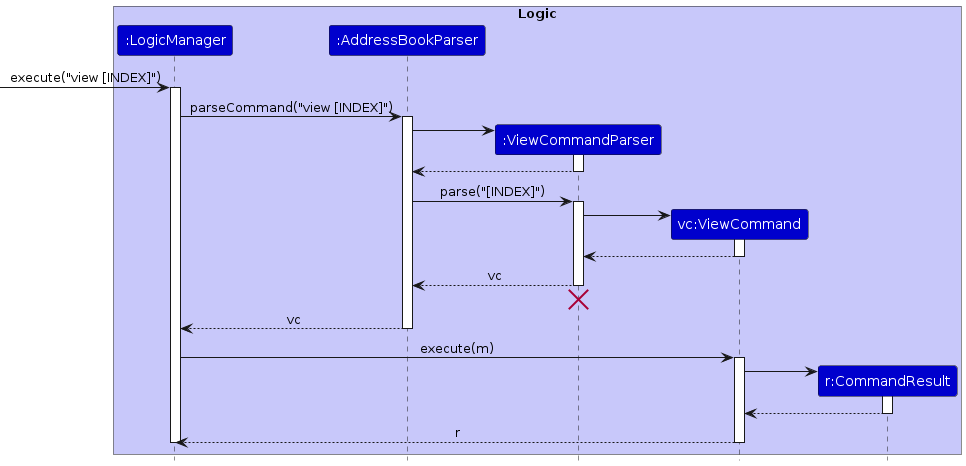
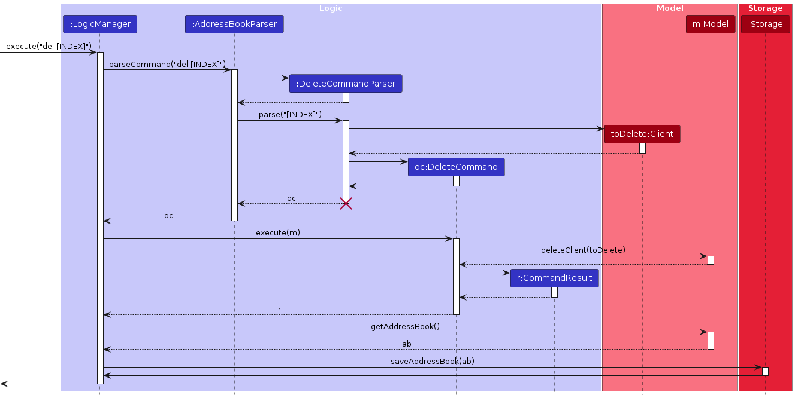
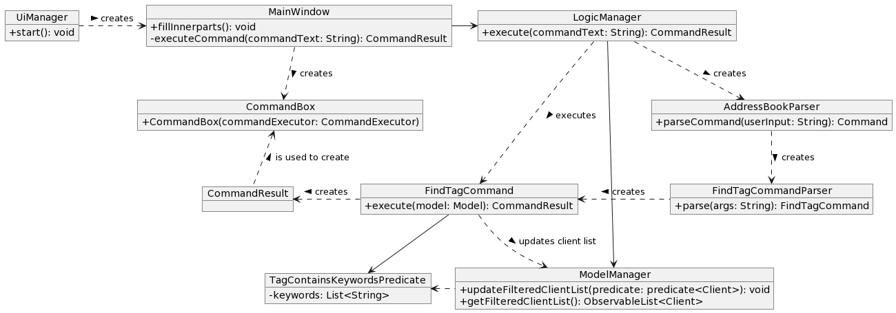
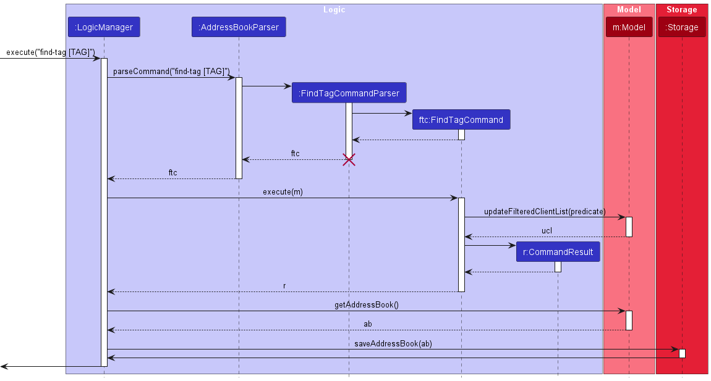

* Table of Contents
{:toc}

--------------------------------------------------------------------------------------------------------------------

## **Acknowledgements**

* This project is based on (forked from) the AddressBook-Level3 project created by the [SE-EDU initiative](https://se-education.org)
* Libraries used: [JavaFX](https://openjfx.io/), [Jackson](https://github.com/FasterXML/jackson), [JUnit5](https://github.com/junit-team/junit5)
* AI Usage: ChatGPT by OpenAI, Github Copilot
  * Used to answer design questions and write skeleton code.

--------------------------------------------------------------------------------------------------------------------

## **Setting up, getting started**

Refer to the guide [_Setting up and getting started_](SettingUp.md).

--------------------------------------------------------------------------------------------------------------------

## **Design**

:bulb: **Tip:** The `.puml` files used to create diagrams in this document `docs/diagrams` folder. Refer to the [_PlantUML Tutorial_ at se-edu/guides](https://se-education.org/guides/tutorials/plantUml.html) to learn how to create and edit diagrams.

### Architecture

The ***Architecture Diagram*** given above explains the high-level design of the App.

Given below is a quick overview of main components and how they interact with each other.

**Main components of the architecture**

**`Main`** (consisting of classes [`Main`](https://github.com/se-edu/addressbook-level3/tree/master/src/main/java/seedu/address/Main.java) and [`MainApp`](https://github.com/se-edu/addressbook-level3/tree/master/src/main/java/seedu/address/MainApp.java)) is in charge of the app launch and shut down.
* At app launch, it initializes the other components in the correct sequence, and connects them up with each other.
* At shut down, it shuts down the other components and invokes cleanup methods where necessary.

The bulk of the app's work is done by the following four components:

* [**`UI`**](#ui-component): The UI of the App.
* [**`Logic`**](#logic-component): The command executor.
* [**`Model`**](#model-component): Holds the data of the App in memory.
* [**`Storage`**](#storage-component): Reads data from, and writes data to, the hard disk.

[**`Commons`**](#common-classes) represents a collection of classes used by multiple other components.

**How the architecture components interact with each other**

The *Sequence Diagram* below shows how the components interact with each other for the scenario where the user issues the command `del 1`.

Each of the four main components (also shown in the diagram above),

* defines its *API* in an `interface` with the same name as the Component.
* implements its functionality using a concrete `{Component Name}Manager` class (which follows the corresponding API `interface` mentioned in the previous point.

For example, the `Logic` component defines its API in the `Logic.java` interface and implements its functionality using the `LogicManager.java` class which follows the `Logic` interface. Other components interact with a given component through its interface rather than the concrete class (reason: to prevent outside component's being coupled to the implementation of a component), as illustrated in the (partial) class diagram below.

The sections below give more details of each component.

### UI component

The **API** of this component is specified in [`Ui.java`](https://github.com/se-edu/addressbook-level3/tree/master/src/main/java/seedu/address/ui/Ui.java)

The UI consists of a `MainWindow` that is made up of parts e.g.`CommandBox`, `ResultDisplay`, `ClientListPanel`, `StatusBarFooter` etc. All these, including the `MainWindow`, inherit from the abstract `UiPart` class which captures the commonalities between classes that represent parts of the visible GUI.

The `UI` component uses the JavaFx UI framework. The layout of these UI parts are defined in matching `.fxml` files that are in the `src/main/resources/view` folder. For example, the layout of the [`MainWindow`](https://github.com/se-edu/addressbook-level3/tree/master/src/main/java/seedu/address/ui/MainWindow.java) is specified in [`MainWindow.fxml`](https://github.com/se-edu/addressbook-level3/tree/master/src/main/resources/view/MainWindow.fxml)

The `UI` component,

* executes user commands using the `Logic` component.
* listens for changes to `Model` data so that the UI can be updated with the modified data.
* keeps a reference to the `Logic` component, because the `UI` relies on the `Logic` to execute commands.
* depends on some classes in the `Model` component, as it displays `Client` object residing in the `Model`.

### Logic component

**API** : [`Logic.java`](https://github.com/se-edu/addressbook-level3/tree/master/src/main/java/seedu/address/logic/Logic.java)

Here's a (partial) class diagram of the `Logic` component:

The sequence diagram below illustrates the interactions within the `Logic` component, taking `execute("del 1")` API call as an example.

:information_source: **Note:** The lifeline for `DeleteCommandParser` should end at the destroy marker (X) but due to a limitation of PlantUML, the lifeline continues till the end of diagram.

How the `Logic` component works:

1. When `Logic` is called upon to execute a command, it is passed to an `AddressBookParser` object which in turn creates a parser that matches the command (e.g., `DeleteCommandParser`) and uses it to parse the command.
1. This results in a `Command` object (more precisely, an object of one of its subclasses e.g., `DeleteCommand`) which is executed by the `LogicManager`.
1. The command can communicate with the `Model` when it is executed (e.g. to delete a client). 
   Note that although this is shown as a single step in the diagram above (for simplicity), in the code it can take several interactions (between the command object and the `Model`) to achieve.
1. The result of the command execution is encapsulated as a `CommandResult` object which is returned back from `Logic`.

Here are the other classes in `Logic` (omitted from the class diagram above) that are used for parsing a user command:

How the parsing works:
* When called upon to parse a user command, the `AddressBookParser` class creates an `XYZCommandParser` (`XYZ` is a placeholder for the specific command name e.g., `AddCommandParser`) which uses the other classes shown above to parse the user command and create a `XYZCommand` object (e.g., `AddCommand`) which the `AddressBookParser` returns back as a `Command` object.
* All `XYZCommandParser` classes (e.g., `AddCommandParser`, `DeleteCommandParser`, ...) inherit from the `Parser` interface so that they can be treated similarly where possible e.g, during testing.

### Model component
**API** : [`Model.java`](https://github.com/se-edu/addressbook-level3/tree/master/src/main/java/seedu/address/model/Model.java)

The `Model` component,

* stores the address book data i.e., all `Client` objects (which are contained in a `UniqueClientList` object).
* stores the currently 'selected' `Client` objects (e.g., results of a search query) as a separate _filtered_ list which is exposed to outsiders as an unmodifiable `ObservableList<Client>` that can be 'observed' e.g. the UI can be bound to this list so that the UI automatically updates when the data in the list change.
* stores a `UserPref` object that represents the user’s preferences. This is exposed to the outside as a `ReadOnlyUserPref` objects.
* does not depend on any of the other three components (as the `Model` represents data entities of the domain, they should make sense on their own without depending on other components)

:information_source: **Note:** An alternative (arguably, a more OOP) model is given below. It has a `Tag` list in the `AddressBook`, which `Client` references. This allows `AddressBook` to only require one `Tag` object per unique tag, instead of each `Client` needing their own `Tag` objects. 

### Storage component

**API** : [`Storage.java`](https://github.com/se-edu/addressbook-level3/tree/master/src/main/java/seedu/address/storage/Storage.java)

The `Storage` component,
* can save both address book data and user preference data in JSON format, and read them back into corresponding objects.
* inherits from both `AddressBookStorage` and `UserPrefStorage`, which means it can be treated as either one (if only the functionality of only one is needed).
* depends on some classes in the `Model` component (because the `Storage` component's job is to save/retrieve objects that belong to the `Model`)

### Common classes

Classes used by multiple components are in the `seedu.addressbook.commons` package.

--------------------------------------------------------------------------------------------------------------------

## **Implementation**

This section describes some noteworthy details on how certain features are implemented.

### Add command

This section describes how the add commands work which will serve as a basic understanding of how commands are implemented.  

**AddressBookParser** : [`AddressBookParser`](https://github.com/AY2324S2-CS2103T-T17-1/tp/blob/master/src/main/java/seedu/address/logic/parser/AddressBookParser.java)
**AddCommandParser** : [`AddCommandParser.java`](https://github.com/AY2324S2-CS2103T-T17-1/tp/blob/master/src/main/java/seedu/address/logic/parser/AddCommandParser.java)
**AddCommand** : [`AddCommand.java`](https://github.com/AY2324S2-CS2103T-T17-1/tp/blob/master/src/main/java/seedu/address/logic/commands/AddCommand.java)

The sequence diagram below illustrates the interactions within the `Logic` component, taking `execute("add --name=Name --phone=2103 --email=hello@Test --addr=Address --tags=hello --tags=Hi --note=NA")` API call as an example.

![Interactions Inside the Logic Component for the `add [ARGS]` Command](images/AddSequenceDiagram.png)

:information_source: **Note:** The lifeline for `AddCommandParser` should end at the destroy marker (X) but due to a limitation of PlantUML, the lifeline continues till the end of diagram.

Note: `[ARGS]` refer to the arguments of the add command that have been parsed. It have been shortened for brevity

How an `add` command is executed:
1. When Logic is called upon to execute a command, it is passed to an `AddressBookParser`.
   object which in turn creates a parser that matches the command `AddCommandParser`).
   and uses it to parse the arguments passed to the command.
2. `AddCommand` will check that the fields: `name`, `phone`, `email`, `address` and `note` are present.
   The prefixes for these options are defined in [CliSyntax.java](https://github.com/AY2324S2-CS2103T-T17-1/tp/blob/master/src/main/java/seedu/address/logic/parser/CliSyntax.java).
    1. Parsing of the arguments is done by [`ArgumentTokenizer.java`](https://github.com/AY2324S2-CS2103T-T17-1/tp/blob/master/src/main/java/seedu/address/logic/parser/ArgumentTokenizer.java) (not shown here).
    2. This returns a [`ArgumentMultiMap`](https://github.com/AY2324S2-CS2103T-T17-1/tp/blob/fd570551588e8c9cf372ca6bc87d3c3e5e01b40a/src/main/java/seedu/address/logic/parser/ArgumentMultimap.java#L20) which supports further operations.  
3. If any of the required prefixes are missing, it will throw a [ParseException](https://github.com/AY2324S2-CS2103T-T17-1/tp/blob/master/src/main/java/seedu/address/logic/parser/exceptions/ParseException.java#L8), which will print a message indicating the correct usage and missing fields, if any.
4. It will then create the [`Client`](https://github.com/AY2324S2-CS2103T-T17-1/tp/blob/master/src/main/java/seedu/address/model/client/Client.java) to represent the Client to be created.
5. The `Client` is used as an argument to create an [`AddCommand.java`](https://github.com/AY2324S2-CS2103T-T17-1/tp/blob/master/src/main/java/seedu/address/logic/commands/AddCommand.java).
6. The `AddCommand` is returned by the parser which is passed on by `AddressBookParser` which passes it to [`LogicManager`](https://github.com/AY2324S2-CS2103T-T17-1/tp/blob/master/src/main/java/seedu/address/logic/LogicManager.java).
7. `LogicManager` calls the [`execute` method](https://github.com/AY2324S2-CS2103T-T17-1/tp/blob/master/src/main/java/seedu/address/logic/commands/AddCommand.java#L52) of `AddCommand` with its model object as a parameter.
8. `AddCommand` returns a [`CommandResult`](https://github.com/AY2324S2-CS2103T-T17-1/tp/blob/master/src/main/java/seedu/address/logic/commands/CommandResult.java).
9. LogicManager will call `getAddressBook` of `Model` and then use it as an argument to call `saveAddressBook` of its `storage` variable.

### View command

This section describes how the `view` command works and is implemented.

The Object, Sequence and Activity UML diagrams belows shows the objects created as well as their interactions (e.g. method calls) when the `view` command is activated.

#### Class Diagram

#### Sequence Diagram

#### Activity Diagram

How a `view` command is executed:
1. User Input Parsing
   1. When the user enters a command, it is first parsed by the `AddressBookParser`.
   2. The `parseCommand(String userInput)` method in `AddressBookParser` splits the user input into the command word and arguments using a regular expression.
   3. If the command word matches "view", the parsing is delegated to the `ViewCommandParser`.
2. View Command Parsing:
   1. The `ViewCommandParser` expects the arguments to contain an index, which represents the position of the item to view in the list.
   2. The `parse(String args)` method in `ViewCommandParser` parses the index from the arguments using `ParserUtil.parseIndex(args)`.
3. Command Execution
   1. Once the index is parsed successfully, a new `ViewCommand` object is created with the parsed index.
   2. The `ViewCommand` Object is returned to the `AddressBookParser` and then to the `LogicManager`.
   3. The `LogicManager` executes the command and generates a `CommandResult`.
4. `MainWindow` creates a `CommandBox` with the resulting command output, allowing the user to view a contact's information.

### Delete command

This section describes how the `delete` command works and is implemented.

The Sequence and Activity UML diagrams belows shows the objects created as well as their interactions (e.g. method calls) when the `delete` command is activated.

#### Sequence Diagram

#### Activity Diagram

How a `delete` command is executed:
1. User Input Parsing
   1. When the user enters a command, it is first parsed by the `AddressBookParser`.
   2. The `parseCommand(String userInput)` method in `AddressBookParser` splits the user input into the command word and arguments using a regular expression.
   3. If the command word matches "del", the parsing is delegated to the `DeleteCommandParser`.
2. Delete Command Parsing:
   1. The `DeleteCommandParser` expects the arguments to contain an index, which represents the position of the client to delete in the list.
   2. The `parse(String args)` method in `DeleteCommandParser` parses the index from the arguments using `ParserUtil.parseIndex(args)`.
3. Command Execution
   1. Once the index is parsed successfully, a new `DeleteCommand` object is created with the parsed index.
   2. The `DeleteCommand` Object is returned to the `AddressBookParser` and then to the `LogicManager`.
   3. The `LogicManager` executes the command and generates a `CommandResult`.
4. `MainWindow` creates a `CommandBox` with the resulting command output, deleting the client at the specified index from the Address Book.

### Find-Tag Command

This section describes how the `find-Tag` command works and is implemented.

The Sequence and Activity UML diagrams belows shows the objects created as well as their interactions (e.g. method calls) when the `find-Tag` command is activated.

#### Class Diagram

#### Sequence Diagram

>

#### Activity Diagram

How a `find-tag` command is executed:
1. The User inputs a command in the format of "find-tag [TAG]" to find clients by tag.
   1. `LogicManager` receives the user command and parses the command to the `AddressBookParser`.
   2. `AddressBookParser` parses this command to the `FindTagCommandParser`.
   3. `FindTagCommandParser` creates a new instance of `FindTagCommand` using the tag as a predicate.
2. `FindTagCommand` instance is returned to the `LogicManager`.
   1. `LogicManager` calls the execute() method of the `FindTagCommand` instance.
   2. A `CommandResult` is generated and returned to `MainWindow`.
3. `MainWindow` creates a `CommandBox` with the resulting command output, listing our all clients with the specified tag.

### Schedule command

#### Work in progress Implementation
To keep things simple, client will keep an immutable ArrayList of Appointments
Hence the way to schedule will functionally work like a combination of the existing add and edit command:
  * Adding an appointment
  * Editing a client to include the new appointments
As we added new fields, edit command need to be edited to carry over 

#### Stuff to be updated: TODO
1. Edit Command
2. View command changed to reflect appointments (UI)
3. Add a view (upcoming) appointments
4. Deleting an appointment
5. Moidying storage to ensure appointments are stored

[//]: # (### \[Proposed\] Undo/redo feature)

[//]: # ()
[//]: # (#### Proposed Implementation)

[//]: # ()
[//]: # (The proposed undo/redo mechanism is facilitated by `VersionedAddressBook`. It extends `AddressBook` with an undo/redo history, stored internally as an `addressBookStateList` and `currentStatePointer`. Additionally, it implements the following operations:)

[//]: # ()
[//]: # (* `VersionedAddressBook#commit&#40;&#41;` — Saves the current address book state in its history.)

[//]: # (* `VersionedAddressBook#undo&#40;&#41;` — Restores the previous address book state from its history.)

[//]: # (* `VersionedAddressBook#redo&#40;&#41;` — Restores a previously undone address book state from its history.)

[//]: # ()
[//]: # (These operations are exposed in the `Model` interface as `Model#commitAddressBook&#40;&#41;`, `Model#undoAddressBook&#40;&#41;` and `Model#redoAddressBook&#40;&#41;` respectively.)

[//]: # ()
[//]: # (Given below is an example usage scenario and how the undo/redo mechanism behaves at each step.)

[//]: # ()
[//]: # (Step 1. The user launches the application for the first time. The `VersionedAddressBook` will be initialized with the initial address book state, and the `currentStatePointer` pointing to that single address book state.)

[//]: # ()
[//]: # (![UndoRedoState0]&#40;images/UndoRedoState0.png&#41;)

[//]: # ()
[//]: # (Step 2. The user executes `delete 5` command to delete the 5th client in the address book. The `delete` command calls `Model#commitAddressBook&#40;&#41;`, causing the modified state of the address book after the `delete 5` command executes to be saved in the `addressBookStateList`, and the `currentStatePointer` is shifted to the newly inserted address book state.)

[//]: # ()
[//]: # (![UndoRedoState1]&#40;images/UndoRedoState1.png&#41;)

[//]: # ()
[//]: # (Step 3. The user executes `add n/David …​` to add a new client. The `add` command also calls `Model#commitAddressBook&#40;&#41;`, causing another modified address book state to be saved into the `addressBookStateList`.)

[//]: # ()
[//]: # (![UndoRedoState2]&#40;images/UndoRedoState2.png&#41;)

[//]: # ()
[//]: # (
:information_source: **Note:** If a command fails its execution, it will not call `Model#commitAddressBook&#40;&#41;`, so the address book state will not be saved into the `addressBookStateList`.)

[//]: # ()
[//]: # (
)

[//]: # ()
[//]: # (Step 4. The user now decides that adding the client was a mistake, and decides to undo that action by executing the `undo` command. The `undo` command will call `Model#undoAddressBook&#40;&#41;`, which will shift the `currentStatePointer` once to the left, pointing it to the previous address book state, and restores the address book to that state.)

[//]: # ()
[//]: # (![UndoRedoState3]&#40;images/UndoRedoState3.png&#41;)

[//]: # ()
[//]: # (
:information_source: **Note:** If the `currentStatePointer` is at index 0, pointing to the initial AddressBook state, then there are no previous AddressBook states to restore. The `undo` command uses `Model#canUndoAddressBook&#40;&#41;` to check if this is the case. If so, it will return an error to the user rather)

[//]: # (than attempting to perform the undo.)

[//]: # ()
[//]: # (
)

[//]: # ()
[//]: # (The following sequence diagram shows how an undo operation goes through the `Logic` component:)

[//]: # ()
[//]: # (![UndoSequenceDiagram]&#40;images/UndoSequenceDiagram-Logic.png&#41;)

[//]: # ()
[//]: # (
:information_source: **Note:** The lifeline for `UndoCommand` should end at the destroy marker &#40;X&#41; but due to a limitation of PlantUML, the lifeline reaches the end of diagram.)

[//]: # ()
[//]: # (
)

[//]: # ()
[//]: # (Similarly, how an undo operation goes through the `Model` component is shown below:)

[//]: # ()
[//]: # (![UndoSequenceDiagram]&#40;images/UndoSequenceDiagram-Model.png&#41;)

[//]: # ()
[//]: # (The `redo` command does the opposite — it calls `Model#redoAddressBook&#40;&#41;`, which shifts the `currentStatePointer` once to the right, pointing to the previously undone state, and restores the address book to that state.)

[//]: # ()
[//]: # (
:information_source: **Note:** If the `currentStatePointer` is at index `addressBookStateList.size&#40;&#41; - 1`, pointing to the latest address book state, then there are no undone AddressBook states to restore. The `redo` command uses `Model#canRedoAddressBook&#40;&#41;` to check if this is the case. If so, it will return an error to the user rather than attempting to perform the redo.)

[//]: # ()
[//]: # (
)

[//]: # ()
[//]: # (Step 5. The user then decides to execute the command `list`. Commands that do not modify the address book, such as `list`, will usually not call `Model#commitAddressBook&#40;&#41;`, `Model#undoAddressBook&#40;&#41;` or `Model#redoAddressBook&#40;&#41;`. Thus, the `addressBookStateList` remains unchanged.)

[//]: # ()
[//]: # (![UndoRedoState4]&#40;images/UndoRedoState4.png&#41;)

[//]: # ()
[//]: # (Step 6. The user executes `clear`, which calls `Model#commitAddressBook&#40;&#41;`. Since the `currentStatePointer` is not pointing at the end of the `addressBookStateList`, all address book states after the `currentStatePointer` will be purged. Reason: It no longer makes sense to redo the `add n/David …​` command. This is the behavior that most modern desktop applications follow.)

[//]: # ()
[//]: # (![UndoRedoState5]&#40;images/UndoRedoState5.png&#41;)

[//]: # ()
[//]: # (The following activity diagram summarizes what happens when a user executes a new command:)

[//]: # ()
[//]: # (![]&#40;images/CommitActivityDiagram.png&#41;)

[//]: # ()
[//]: # (#### Design considerations:)

[//]: # ()
[//]: # (**Aspect: How undo & redo executes:**)

[//]: # ()
[//]: # (* **Alternative 1 &#40;current choice&#41;:** Saves the entire address book.)

[//]: # (  * Pros: Easy to implement.)

[//]: # (  * Cons: May have performance issues in terms of memory usage.)

[//]: # ()
[//]: # (* **Alternative 2:** Individual command knows how to undo/redo by)

[//]: # (  itself.)

[//]: # (  * Pros: Will use less memory &#40;e.g. for `delete`, just save the client being deleted&#41;.)

[//]: # (  * Cons: We must ensure that the implementation of each individual command are correct.)

[//]: # ()
[//]: # (_{more aspects and alternatives to be added}_)

[//]: # ()
[//]: # (### \[Proposed\] Data archiving)

[//]: # ()
[//]: # (_{Explain here how the data archiving feature will be implemented}_)

--------------------------------------------------------------------------------------------------------------------

## **Documentation, logging, testing, configuration, dev-ops**

* [Documentation guide](Documentation.md)
* [Testing guide](Testing.md)
* [Logging guide](Logging.md)
* [Configuration guide](Configuration.md)
* [DevOps guide](DevOps.md)

--------------------------------------------------------------------------------------------------------------------

## **Appendix: Requirements**

### Product scope

**Target user profile**:

* has a need to manage a significant number of contacts
* has to keep track of a significant number of client appointments and statuses
* prefer desktop apps over other types
* can type fast
* prefers typing to mouse interactions
* is reasonably comfortable using CLI apps

**Value proposition**:
* manage contacts faster than a typical mouse/GUI driven app
* centralized and organized platform for storing and managing contact information and critical stakeholder details

### User stories

Priorities: High (must have) - `* * *`, Medium (nice to have) - `* *`, Low (unlikely to have) - `*`

| Priority | As a …​                                                 | I want to …​                                      | So that I can…​                                                                   |
|----------|---------------------------------------------------------|---------------------------------------------------|-----------------------------------------------------------------------------------|
| `* * *`  | Social Worker                                           | Add a new client                                  | Store my new client's information                                                 |
| `* * *`  | Social Worker                                           | Delete a client                                   | Remove clients that I no longer work with                                         |
| `* * *`  | Social Worker                                           | View a client's information                       | Conveniently access client's details in a easily readable manner                  |
| `* * *`  | Social Worker                                           | List out all current client's contacts            | View all of the current contacts I have saved                                     |
| `* * *`  | Social Worker who has physical meetings with my clients | Add appointments that I have with each client     | Keep track of the physical meetings I have with my clients                        |
| `* * *`  | Social Worker who has physical meetings with my clients | Delete appointments that I have with each client  | Remove any appointments that I no longer have                                     |
| `* * *`  | Social Worker who has physical meetings with my clients | View an appointment's information                 | Be informed of the details that the appointment involves                          |
| `* * *`  | Social Worker who has physical meetings with my clients | List out my appointments in chronological order   | Keep track of my upcoming appointments and which one to prepare for               |
| `* *`    | Social Worker with a diverse range of clients           | Add a tag to selected clients                     | Highlight any important information about the client's current status             |
| `* *`    | Social Worker with a diverse range of clients           | Delete tags from selected clients                 | Remove any tags which no longer apply to the client                               |
| `* *`    | Social Worker with a diverse range of clients           | View the tag attached to the selected clients     | Readily identify the information I wanted to highlight about the client           |
| `* *`    | Social Worker                                           | Edit a client's information                       | Update the contact if there are any changes to a client's information             |
| `*`      | Social Worker with many clients                         | Search for a client by name                       | Efficiently find a client without having to scroll through the address book       |
| `*`      | Social Worker with many clients                         | Search for clients by their tags                  | Categorise clients who share a common tag                                         |
| `*`      | Social Worker with clients that have medical records    | Add information of their medical history          | Keep track of any known conditions, allergies or medications                      |

### Use cases

(For all use cases below, the **System** is `SWEE` and the **Actor** is the `user`, unless specified otherwise)

### **Use case: UC01 - Add a new client into SWEE**

**MSS**

1. User requests to add a client.
2. User inputs details of the client.
3. SWEE adds the client as a contact.
4. SWEE lists out all current contacts that have been saved (UC05).

    Use case ends.

**Extensions**

* 2a. The user's given input format for the client's details is invalid.

    * 2a1. SWEE prompts user to input the client's details in the correct format.
    * 2a2. User inputs in the client's details again.
    * 2a3. Repeat steps 1a1-1a2 until the input is in the correct format.

        Use case resumes at step 3.

### **Use case: UC02 - Edit a client**

**MSS**

1. User requests to edit a client's information.
2. User inputs the fields to be edited.
3. SWEE changes the client's information.
4. SWEE lists out all current contacts that have been saved (UC05).

    Use case ends.

**Extensions**

* 2a. The user's given input format is invalid.

    * 2a1. SWEE shows an error message.
    * 2a2. User inputs in the client's index and edited details again.
    * 2a3. Repeat steps 2a1-2a2 until the input is in the correct format.

      Use case resumes at step 3.

### **Use case: UC03 - Delete a client**

**MSS**

1. User requests to delete a specific client in the list.
2. User inputs the index of the client to delete.
2. SWEE deletes the client.

    Use case ends.

**Extensions**

* 1a. The list is empty.
    * 1a1. SWEE shows an error message.

    Use case ends.

* 1b. The given client index is invalid.

    * 1b1. SWEE shows an error message.
    * 1b2. User inputs in the client index again.
    * 1b3. Repeat steps 1b1-1b2 until the input is a valid index.

    Use case resumes at step 3.

### **Use case: UC04 - View a client's information**

**MSS**

1. User request to view a specific client's information in the list.
2. User inputs the index of the client to view.
3. SWEE displays the client's information to the user.

    Use case ends.

**Extensions**

* 1a. The list is empty.

    Use case ends.

* 2a. The given client index is invalid.

    * 2a1. SWEE shows an error message.
    * 2a2. User inputs in the client index again.
    * 2a3. Repeat steps 2a1-2a2 until the input is a valid index.
    
    Use case resumes at step 3.

### **Use case: UC05 - List all saved clients**

**MSS**

1.  User requests to see the list of all current clients in SWEE.
2.  SWEE presents the user with all the currently saved clients in alphabetical order.

    Use case ends.

### **Use case: UC06 - Find a client by name**

**MSS**

1. User requests to search for the client by name.
2. User inputs name.
3. SWEE returns all clients that match the specified name.

    Use case ends.

**Extensions**

* 2a. No client matches the specified name.
    
    * 2a1. SWEE shows that there are no clients matching the specified name.

    Use case ends.

### **Use case: UC07 - Find a client by Tag**

**MSS**

1. User requests to search for the client by tag.
2. User inputs tag.
3. SWEE returns all clients that match the specified tag.

   Use case ends.

**Extensions**

* 2a. No client matches the specified tag.

    * 2a1. SWEE shows that there are no clients matching the specified tag.

    Use case ends.

### **Use case: UC08 - Schedule an appointment**

**MSS**

1. User requests to add a new appointment for a specific client.
2. User inputs in appointment details.
3. SWEE updates the specified client with the newly added appointment.
4. SWEE lists out all current contacts that have been saved (UC05).

    Use case ends.

**Extensions**

* 2a. The user's given input format is invalid.

    * 2a1. SWEE shows an error message.
    * 2a2. User inputs in the client's index and appointment details again.
    * 2a3. Repeat steps 2a1-2a2 until the input is in the correct format.

    Use case resumes at step 3.

### **Use case: UC09 - Unschedule an appointment**

**MSS**

1. User requests to delete an existing appointment for a specific client.
2. User inputs in the client and appointment index.
3. SWEE updates the specified client by deleting the specified appointment.
4. SWEE lists out all current contacts that have been saved (UC05).

   Use case ends.

**Extensions**

* 2a. The user's given input format is invalid.

    * 2a1. SWEE shows an error message.
    * 2a2. User inputs in the client's index and appointment index again.
    * 2a3. Repeat steps 2a1-2a2 until the input is in the correct format.

    Use case resumes at step 3.

### Non-Functional Requirements

1.  Should work on any _mainstream OS_ as long as it has Java `11` or above installed.
2.  Should come in a standalone JAR file that does not require anything beyond Java 11 to run (i.e. installing additional libraries or frameworks).
3.  A user with above average typing speed for regular English text (i.e. not code, not system admin commands) should be able to accomplish most of the tasks faster using commands than using the mouse.
4.  Should have an intuitive and user-friendly interface, making it easy for the user to navigate, input, and retrieve client information and appointments efficiently.
5.  Should come with comprehensive documentation and user support to assist users in using the app effectively and troubleshooting any issues that may arise.
6.  Should be stable and dependable, minimizing the risk of crashes or data loss, and ensuring that appointments and client information are accurately stored and retrieved.
7.  Should be able to accommodate the growing number of clients and appointments without a significant decrease in performance or usability.

*{More to be added}*

### Glossary

* **CLI**: Command Line Interface, User interact with SWEE by typing commands
* **Mainstream OS**: Windows, Linux, Unix, MacOS
* **Private contact detail**: A contact detail that is not meant to be shared with others
* **Client**: People who are experiencing various challenges in life and receiving assistance by working with the User
* **Appointment**: When User meets with the client to assist them

--------------------------------------------------------------------------------------------------------------------

## **Appendix: Planned Enhancements**

**Team size: 5**

1. Allow editing appointment information, i.e. changing the title, address or date/times.
2. Use strict datetime resolver, so it will reject invalid dates like "31/02/2024" instead of trying to fit to the nearest valid date.

--------------------------------------------------------------------------------------------------------------------

## **Appendix: Instructions for manual testing**

Given below are instructions to test the app manually.

:information_source: **Note:** These instructions only provide a starting point for testers to work on;
testers are expected to do more *exploratory* testing.

### Launch and shutdown

1. Initial launch

   1. Download the jar file and copy into an empty folder

   1. Double-click the jar file Expected: Shows the GUI with a set of sample contacts. The window size may not be optimum.

1. Saving window preferences

   1. Resize the window to an optimum size. Move the window to a different location. Close the window.

   1. Re-launch the app by double-clicking the jar file. 
       Expected: The most recent window size and location is retained.

### Deleting a client

1. Deleting a client while all clients are being shown

   1. Prerequisites: List all clients using the `list` command. Multiple clients in the list.

   1. Test case: `del 1` 
      Expected: First contact is deleted from the list. Details of the deleted contact shown in the status message. Timestamp in the status bar is updated.

   1. Test case: `del 0` 
      Expected: No client is deleted. Error details shown in the status message. Status bar remains the same.

   1. Other incorrect delete commands to try: `del`, `del x`, `...` (where x is larger than the list size) 
      Expected: Similar to previous.

### New User tutorial

1. Run through the entire new user tutorial [in `User Guide > Quick Start > New User Tutorial`](https://ay2324s2-cs2103t-t17-1.github.io/tp/UserGuide.html#new-user-tutorial).

2. The guide will take you through all essential features of SWEE.

[//]: # (### Saving data)

[//]: # ()
[//]: # (1. Dealing with missing/corrupted data files)

[//]: # ()
[//]: # (   1. _{explain how to simulate a missing/corrupted file, and the expected behavior}_)

[//]: # ()
[//]: # (1. _{ more test cases …​ }_)
